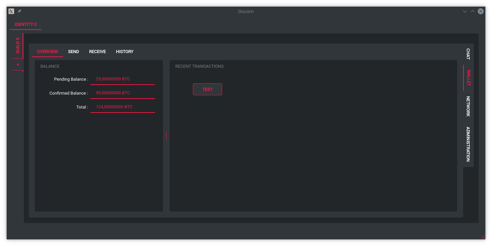

# Discorn Project
-----------------

Discorn is an **encrypted and decentralized chatting** protocol based on cryptocurrencies.

# Table of contents :
* [Usefull Links](#Links)
* [Contributing](#Contributing)
* [Using Discorn](#Using)
* [Python implementation](#PyImplementation)
    * [Installation](#PyInstall)
    * [Qt Gui](#PyQtGui)
* [Why ?](#Why)
* [How ?](#How)

# Usefull links <a name="user-content-Links"></a>
--------------
* [Latest Discorn Library documentation](https://moriya.zapto.org/docs/discorn/master/)
* [Latest Discorn Protocol documentation](https://moriya.zapto.org/docs/discorn/latex/master/main.pdf)
# Contributing <a name="user-content-Contributing"></a>
--------------
Contributions are made via Github issues and pull requests. [Gitsokyo](https://moriya.zapto.org/gitsokyo/Discorn/Discorn) is now only a mirror.

Fork the project on github then clone your fork.
The project runs Python 3.8.
Dependencies are managed using **Pipenv**.

Developpement environement :
``` bash
~ git clone <fork url>
~ cd Discorn
~ pipenv sync --dev
```

Building Library Documentation (results are in doc/sphinx_src/build/html/)
``` bash
~ make sphinx
```


Building Protocol Documentation (requires pdflatex, results are in doc/sphinx_src/build/html/)
``` bash
~ make latex
```

Building the UI files (GUI)
``` bash
~ make ui
```

# Using Discorn <a name="user-content-Using"></a>
---------------
Discorn is still in Developpement phase. It is absolutely not usable in any way.

# Python Implementation <a name="user-content-PyImplementation"></a>
----------------------

## Installation (Pipenv) <a name="user-content-PyInstall"></a>

``` bash
~ git clone https://moriya.zapto.org/gitsokyo/Discorn/Discorn.git
~ cd Discorn
~ pipenv install
```

## Qt Gui <a name="user-content-PyQtGui"></a>
``` bash
~ make gui && python -m Gui.main
```

Here's how it looks so far.  


# Why ? <a name="user-content-Why"></a>
-------
Computers bring with them a brand new problem : **It has become hard to get forgotten.**  
Everything one shares with a company over the internet is potentially stored forever.  
Malicious entities such as potential future governments might use such data against part of the population and **endanger democracy**.

We defend a **basic right to privacy** and we are going to claim it no matter what thanks to **cryptography**.

Encrypted and Federated chatting apps exists. The main example is obviously [Matrix](https://matrix.org/)  
However, Federated software is flawed : They are instance based, and running a personnal instance is hard, requires perfoming hardware and requires registering a Domain Name.
About matrix, it leaks several features that makes private alternatives more interesting.

But why Federated ? Let's go fully decentralized.  

**Bitcoin** shows a new way of creating software over the Internet, and beyond.
It's fundamentals are :

* A decentralized consensus (about order of events and current time)
* Incentivising node owners to help secure the network by taking part in the vote.

Such a system can be used for many applications and it has been.

What does the end user win when using Discorn ?  
Privacy is the main one.
Discorn is mainly inspired by Discord, as we find that Discord is more or less the way chatting app should look like.
But Discorn is **open-source** and **decentralized** this means that people will be able to mod Discorn as they wish with no fear of getting banned, and potentially will have more features than Discord.

# How ? <a name="user-content-How"></a>
-------
Discorn is inspired by Bitcoin, Cryptonote and Discord, so we will use concepts from them.

Discorn will be organised in **Guilds**.  
A Guild is either owned by someone or is fully decentralized.
To each Guild is attached a **Blockchain** and **Cryptocurrency** and a **Database of events**.
The Blockchain's proof of work algorithm is Cryptonight, as we believe cpu-mining is what we should aim for.
